# DECK//OS

Cyberdeck firmware for the **M5Stack Tab5** (ESP32-P4, 5" 1280x720) with the
official **Tab5 Keyboard**. A touch-first, keyboard-friendly launcher with a
cyberpunk HUD, hosting modules for SSH, markdown notes, a calculator,
weather, a music player and a LAN file portal.

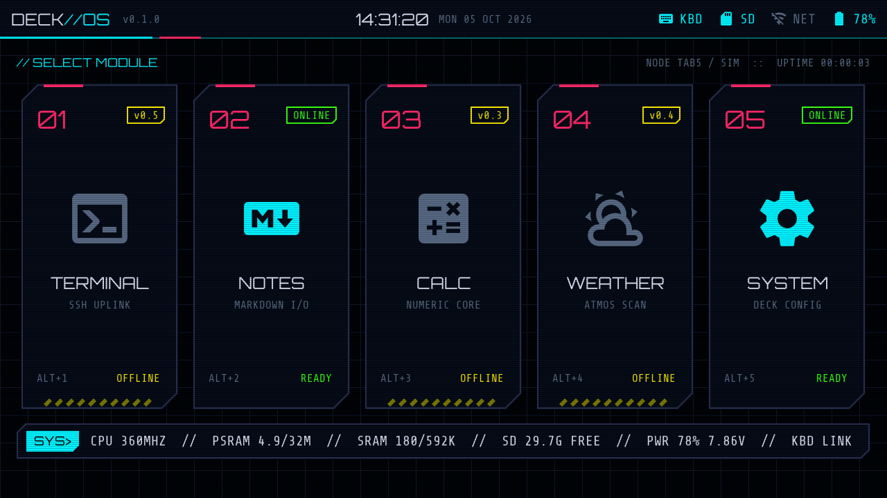

| Boot POST | System module | Scheduled module |
|---|---|---|
| 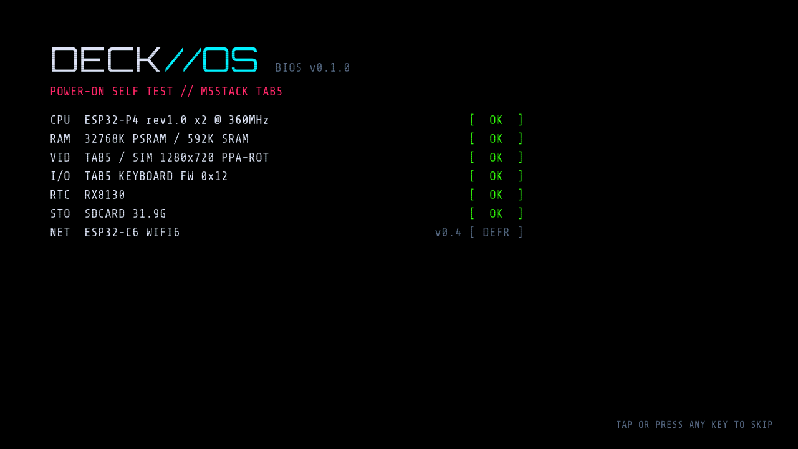 | 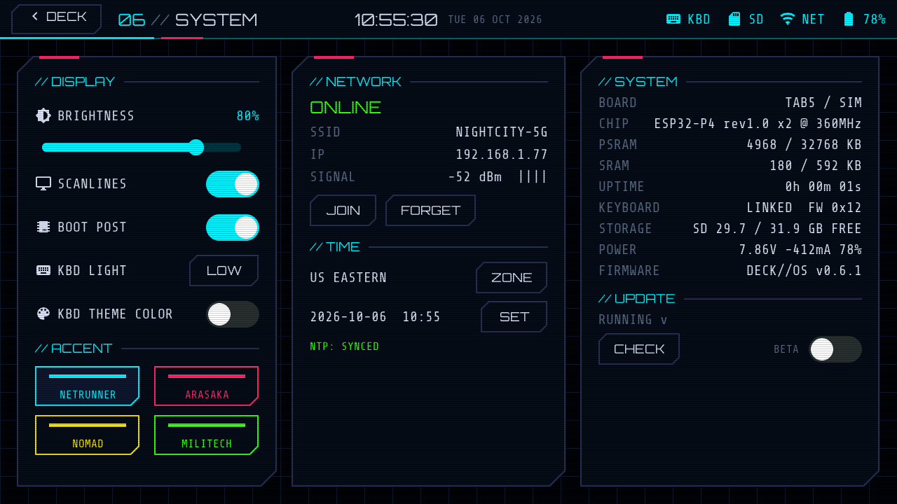 | 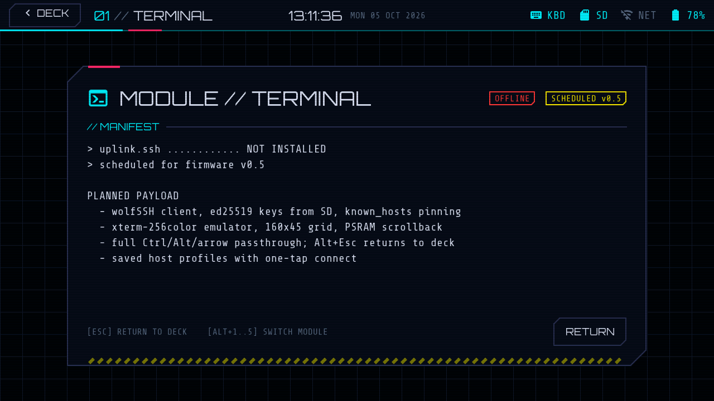 |

## Status: v1.0.0

Seven modules: TERMINAL (SSH), NOTES (markdown), CALC, WEATHER, PLAYER
(music), PORTAL (LAN file manager) and SYSTEM. It updates itself over Wi-Fi
with signed builds and tells you when a new one is out.

**v1.0:** the deck checks for updates at startup and every hour, and offers a
new build in a popup: INSTALL, IGNORE (skip that version) or LATER. It waits
for a good moment: not while the screen sleeps, in TERMINAL, or during a
portal transfer.

### v0.8.0: music player

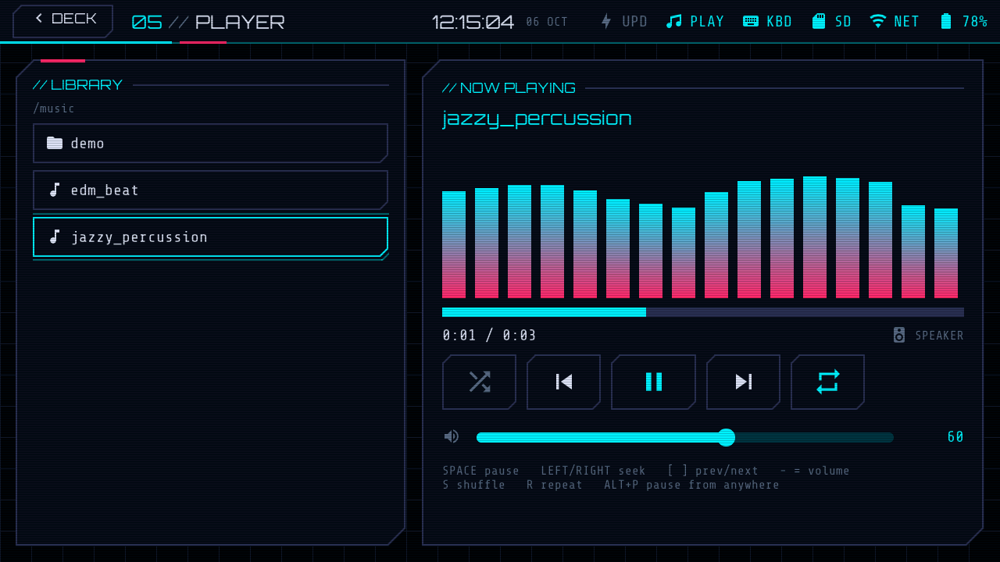

**v0.8:** PLAYER (module 05) plays MP3s from `/music` on the SD card through
the speaker, or the headphone jack when something is plugged in. Browse by
folder, pick a track, and the folder becomes the queue. You get a 16-band
spectrum, ID3 titles, seek (tap the bar or `Left`/`Right`), volume, shuffle and
repeat. Music keeps playing while you use other modules: PLAY in the status bar
(tap it to come back), and `Alt+P` pauses from anywhere. Fill `/music` from your
Mac with PORTAL.

### v0.7.0: file portal

| On the deck | In your browser |
|---|---|
| 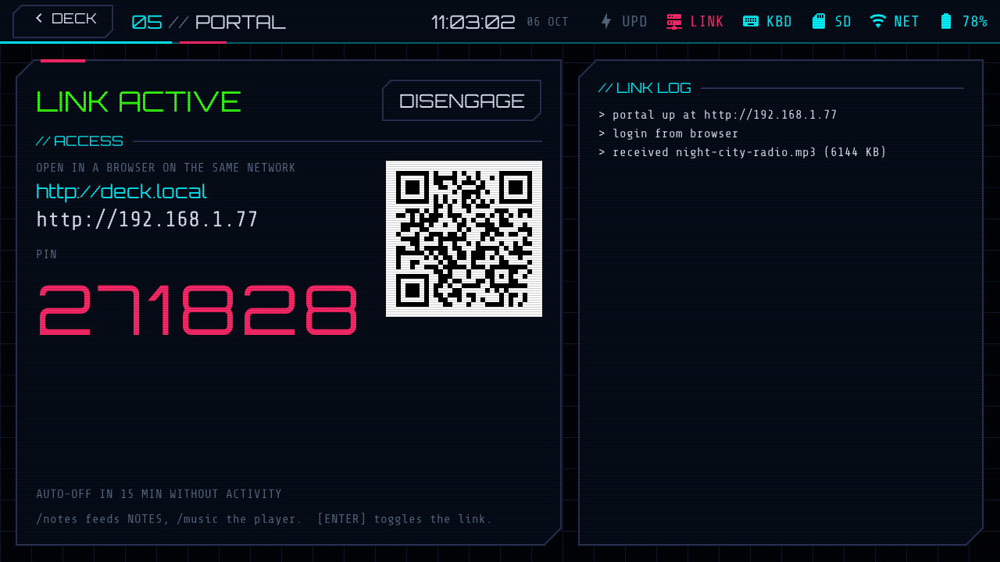 | 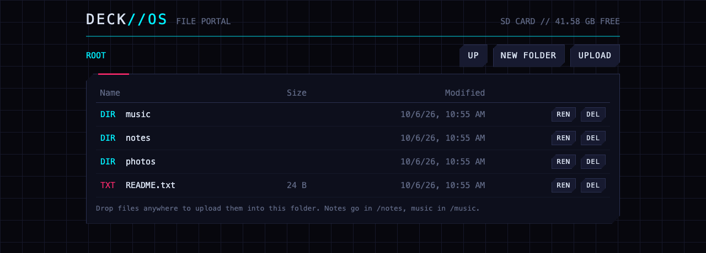 |

**v0.7:** PORTAL (module 05) shares the deck's storage with any browser on
your network. ENGAGE shows `http://deck.local`, the IP, a QR code for phones
and a one-time 6 digit PIN. From the browser: browse, drag and drop uploads,
download, rename, delete and new folders. `/notes` feeds NOTES and `/music`
is ready for the player. The portal keeps running while you use other
modules (LINK in the status bar), switches itself off after 15 minutes idle,
locks for 30 s after 5 wrong PINs, and never exposes the SSH key folder.
It is plain HTTP on your LAN, so use it on networks you trust.

| PIN screen | Link down |
|---|---|
| 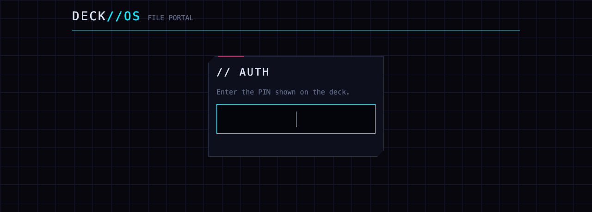 | 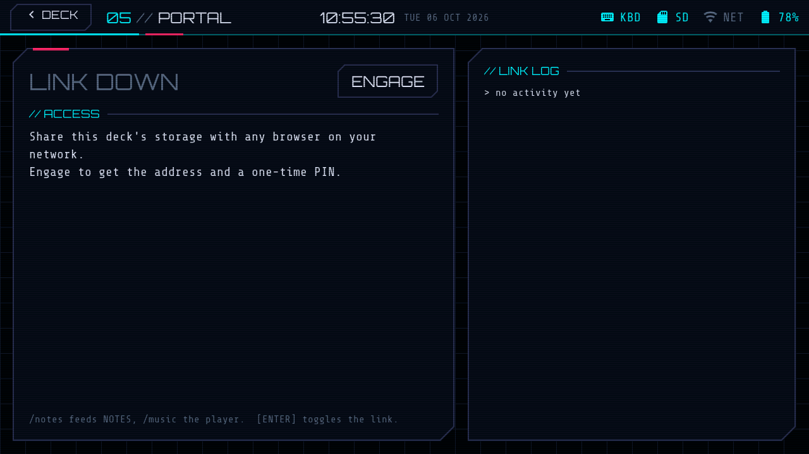 |

**v0.6.1:** SYSTEM > KBD LIGHT (OFF / LOW / HIGH) and KBD THEME COLOR (keyboard
LEDs follow the accent). `Alt+0` or a tap on the clock sleeps the screen.

### v0.6.0: SSH terminal

**v0.6:** TERMINAL is an SSH client with an xterm-compatible screen (256
colors, full-screen apps like htop and vim, 2000 lines of scrollback). Hosts
are saved on the SD card; first connections show the server's fingerprint to
trust, and a changed key gets a loud warning. Log in with a password or the
deck's own ECDSA key (DEVICE KEY shows the public key for authorized_keys).
Every key goes to the remote, Esc included; `Alt+Esc` leaves. The touch bar
adds Esc, Tab, sticky Ctrl, arrows, PgUp/PgDn, Home/End and F1 to F12.
Shift+Up/Down or dragging scrolls back.

### v0.5.0: over-the-air updates

**v0.5:** SYSTEM > UPDATE checks GitHub Releases, installs the new build over
Wi-Fi into the idle app slot, and reboots. A new build must run cleanly for
15 s before it is kept; otherwise the bootloader rolls back to the previous
one. A blinking UPD in the status bar means an update is waiting. The BETA
switch includes pre-releases. Releases from v0.5.0 on carry two images:
`*-full.bin` for USB (written at 0x0) and `*-ota.bin` for over-the-air.

### v0.4.0


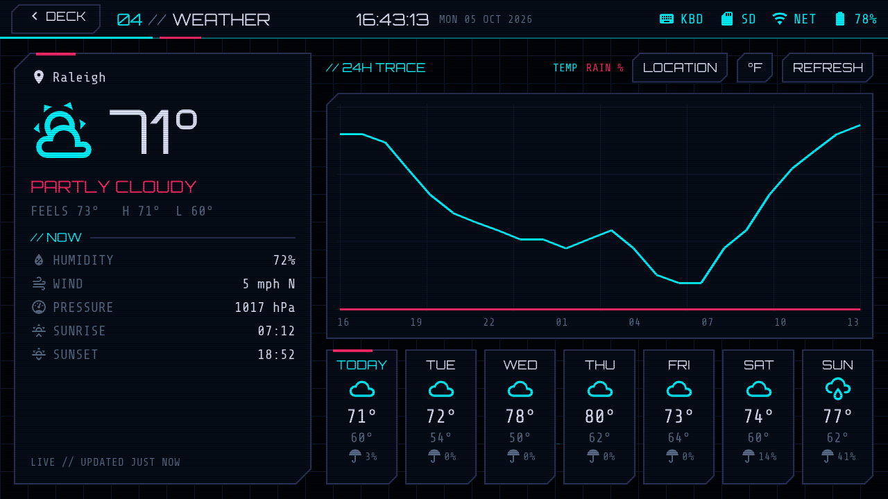

**v0.4:** Wi-Fi through the Tab5's ESP32-C6 (no C6 reflash needed: the
firmware talks to M5Stack's factory ESP-Hosted v1.4.1), network join from
SYSTEM (scan, password, hidden networks, forget), NTP clock sync written back
to the RTC, 17 timezones, and the WEATHER module: Open-Meteo by city search,
current conditions, 24 h temperature and rain trace, 7-day strip, offline
cache. Keys in WEATHER: `R` refresh, `L` location, `U` units.
Parser tests: `cmake --build sim/build --target weather_test && sim/build/weather_test`.

### v0.3.0 (released)

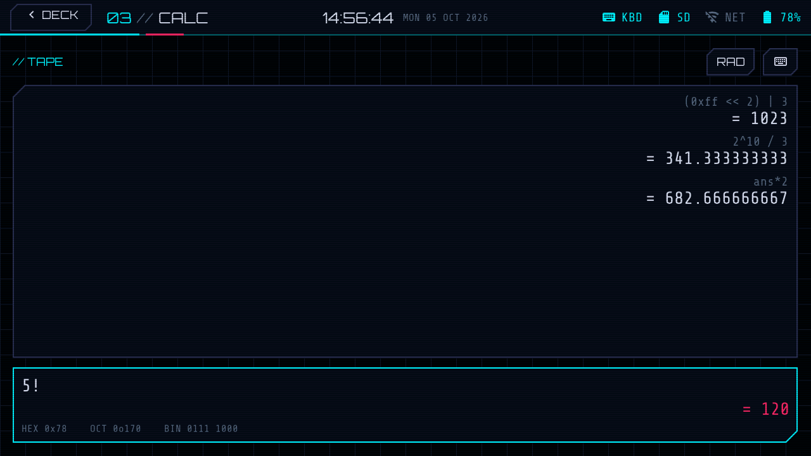

**v0.3:** CALC module with live results as you type, a tape of past
results, hex/oct/bin readout for integers, DEG/RAD, and a touch keypad with
SCI and PROG pages that hides once you type. `Enter` evaluates, `Up/Down`
recall, `Ctrl+D` deg/rad, `Ctrl+K` keypad, `Ctrl+L` clear tape. Engine tests:
`cmake --build sim/build --target calc_test && sim/build/calc_test`.

### v0.2 (merged)

| Notes: split edit + live preview | Notes: preview |
|---|---|
| 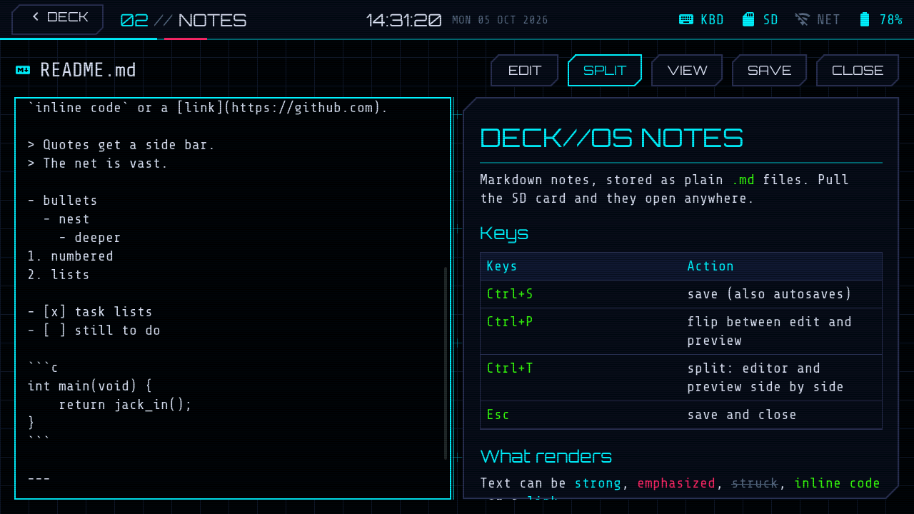 | 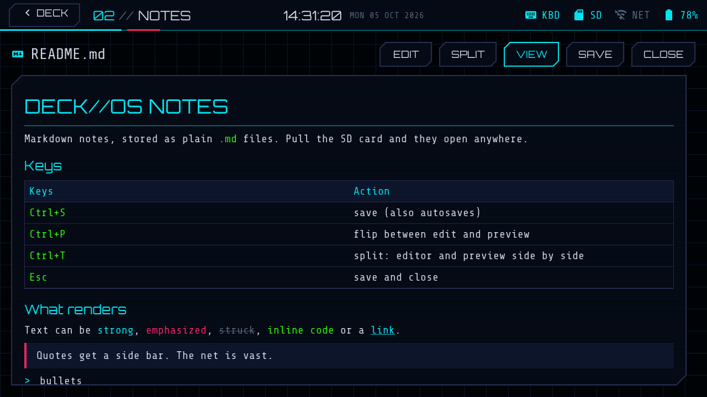 |

**v0.2 so far:** NOTES module with a file browser (new, rename, delete), a
monospace editor, a rendered preview (headings, emphasis, lists, task lists,
quotes, code, tables, rules) and a live split view. Files are plain `.md` in
`/sdcard/notes`, or in internal flash when no card is inserted. `Ctrl+S` save,
`Ctrl+P` edit/preview, `Ctrl+T` split, `Esc` save and close, autosave after
20 s. Partition table is now OTA-ready (see ROADMAP v0.8), which means one USB
flash when moving from v0.1.

### v0.1.0 (released)

- Boot POST that reports real hardware state (keyboard, SD, RTC, battery); tap or any key skips it
- HUD status bar: clock, keyboard link, SD, network, battery
- Launcher with five large touch tiles, keyboard navigation and a live system ticker
- Glitch transitions, optional CRT scanlines, four accent themes (NETRUNNER, ARASAKA, NOMAD, MILITECH)
- **SYSTEM** module: brightness, scanlines, boot sequence, accent, RTC clock setting, live hardware readout
- TERMINAL is a placeholder until v0.7 that show their planned features until their version lands

See [ROADMAP.md](ROADMAP.md) for v0.2 onward.

## Controls

| Keys | Action |
|---|---|
| `Alt+1..7` | Launch module 01..07 |
| `Alt+Esc` | Return to the deck from anywhere (reserved for when SSH owns `Esc`) |
| `Alt+0`, tap the clock, or SYSTEM > SLEEP | Sleep the screen (backlight and keyboard light off); any key or touch wakes it |
| `Alt+H`, or tap the hint on the home screen | List every shortcut |
| `Alt+P` | Pause or resume music from anywhere |
| `Esc` | Back / close, or home if the module does not use it |
| `Left` `Right` `Enter`, or `1..7` | Pick a tile on the home screen |
| `Tab`, arrows | Move focus inside a module |

Everything is also reachable by touch: tiles, the `< DECK` button and on-screen controls.

## Install from the browser

[**hey-its-brian.github.io/tab5-cyberdeck**](https://hey-its-brian.github.io/tab5-cyberdeck/): plug the
Tab5 in over USB-C, click INSTALL in Chrome or Edge. After that, updates come
over Wi-Fi (SYSTEM > UPDATE).

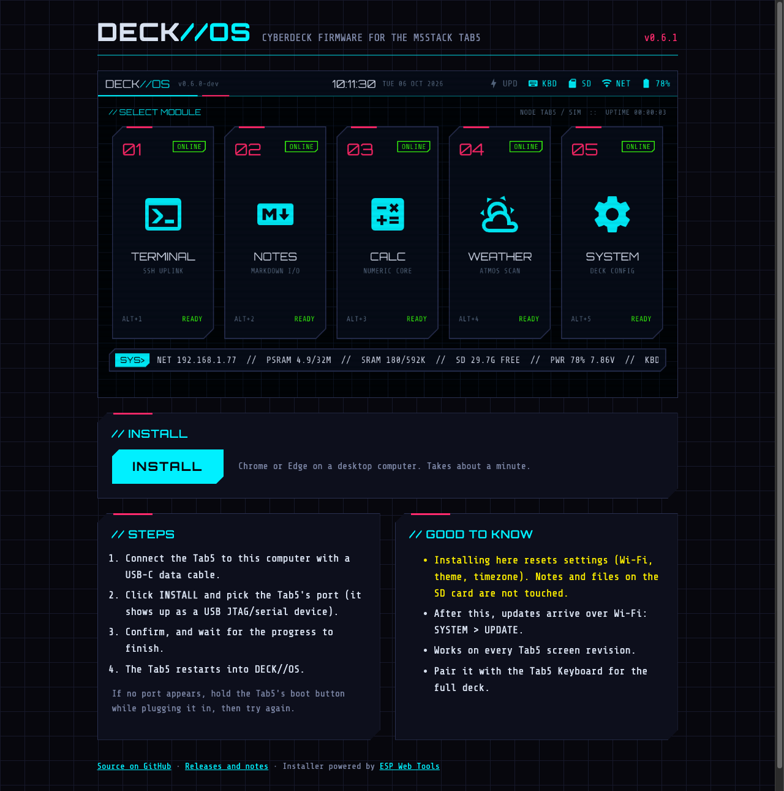

## Security

- **Settings are encrypted** (Wi-Fi password, SSH device key, everything in
  NVS). On its first boot, v0.7.1 or later generates a random key, burns it into
  one free eFuse key block, and moves the existing settings over. This is the
  only eFuse change. It does not restrict flashing, and if anything goes wrong the deck
  falls back to plain settings rather than failing to boot. SYSTEM > SECURITY
  shows which mode is active.
- **Updates are signed.** A deck running a signed build only installs
  over-the-air updates signed with the same key (RSA-3072). Nothing is
  burned for this, and the bootloader does not check signatures, so USB and the web
  flasher can always write any image. A board can't be locked out.
- **The SSH device key** lives in encrypted settings, not on the SD card. A key
  left on the card by v0.6 to v0.7.0 is moved in (same key, so `authorized_keys`
  still matches) and the file is wiped. `known_hosts` stays on the card.
- The file portal is plain HTTP with a one-time PIN. Use it on networks you trust.
- No Secure Boot or flash encryption: both are one-way and could lock a board
  to one signing key.

## Releasing

`tools/release.sh X.Y.Z notes.md "Title"` from a clean `main`: bumps the version,
builds, signs the app, attaches the full (USB/web) and OTA images to a GitHub
release, and the release deploys the web flasher. Betas: `tools/release.sh
X.Y.Z-beta.N notes.md "Title" --prerelease` from any branch (betas skip the web
flasher). The signing key is read from `~/.config/deck-os/ota_signing_key.pem`
(or `DECK_SIGNING_KEY`). Keep it backed up and out of the repo: without it,
signed decks can only be updated over USB.

## Build and flash

Needs ESP-IDF 5.4 or newer.

```bash
. ~/esp/esp-idf/export.sh
```

```bash
idf.py set-target esp32p4
```

```bash
idf.py build
```

```bash
idf.py -p /dev/cu.usbmodem* flash monitor
```

The panel revision (ILI9881C, ST7123 or ST7121) is detected at runtime, so
one image works on every Tab5.

Builds from source are unsigned: the signed-update settings live in
`sdkconfig.release`, which only `tools/release.sh` applies, so a fresh clone
builds and boots without a signing key. An unsigned build installs the official
over-the-air updates too (only signed builds check signatures). Note that, like
the official firmware, any build burns its settings encryption key into a free
eFuse key block on first boot (see Security).

## Desktop simulator

`sim/` runs the same UI code (everything above `deck_hal` and `deck_net`) on
SDL2 with fake hardware and a pretend radio (HTTP goes through `curl`, so
WEATHER shows live data; pass `--wifi` to start "connected"), so screens can be developed and checked without the board. It
reuses the LVGL tree that `idf.py build` downloads (or fetches LVGL 9.5.0 if
that is missing). Needs `brew install sdl2 cmake`.

```bash
cmake -S sim -B sim/build && cmake --build sim/build -j
```

```bash
./sim/build/deck_sim
```

Mouse is touch; the Mac keyboard acts as the Tab5 Keyboard (Option is Alt).
Headless mode renders scripted screenshots on a virtual clock:

```bash
./sim/build/deck_sim --headless --no-boot --key 500:alt+5 --shot 1500:system.ppm
```

`--key MS:SPEC` (e.g. `esc`, `enter`, `left`, `a`, `alt+2`, `ctrl+s`), `--tap MS:X,Y` and
`--shot MS:FILE.ppm` can repeat. Convert with `sips -s format png in.ppm --out out.png`.

The portal's browser side runs on the Mac too: `tools/portal_mock.py` serves
the real page backed by `sim/sdcard` at `http://127.0.0.1:8080` (PIN `271828`,
`--open` skips it, `--root DIR` picks another folder).

## Layout

```
main/                 app_main: hal_init, theme, input, register modules, start shell
components/
  deck_hal/           the only hardware-aware layer (C API); hal_tab5.cpp for the board
  deck_ui/            theme tokens + fonts, chamfered panel widgets, effects
  deck_core/          app registry, key routing, shell, status bar, launcher, boot POST, modals
  deck_md/            markdown to LVGL renderer (md4c)
  deck_net/           Wi-Fi over the ESP32-C6 (ESP-Hosted), SNTP, HTTPS fetch
  deck_portal/        LAN file portal: HTTP server, JSON API, PIN login, mDNS, web page (www/)
  deck_audio/         music player: minimp3 decode task, queue, ID3, ES8388 output (aout_tab5.c)
  minimp3/            minimp3 MP3 decoder (vendored, CC0)
  md4c/               md4c markdown parser (vendored, MIT)
  m5_tab5_component/  M5Stack Tab5 BSP (vendored, MIT)
  m5_tab5_keyboard_component/  M5Stack Tab5 Keyboard driver (vendored, MIT)
apps/                 one component per module (app_sys is the template for real ones)
assets/fonts/         Orbitron, Share Tech Mono, MDI icon subset (tools/subset_icons.sh)
sim/                  SDL2 desktop simulator and fake HAL
```

### Writing a module

A module is a `deck_app_t` with `on_start(parent)` and optional `on_key`,
`on_exit` (save work; widgets still alive) and `on_stop` callbacks (see `components/deck_core/include/deck_app.h`). Build the
UI under `parent` with the `deck_ui` kit, register it in `main/main.c` and in
`sim/main.c`, and add its folder to `main/CMakeLists.txt`.

### Design notes

- **Keyboard path.** The Tab5 Keyboard runs in HID mode over I2C (0x6D on G0/G1)
  and reports releases as code 0. `deck_input` turns events into shell hotkeys,
  then the module's `on_key`, then LVGL keypad keys. It is polled every 10 ms
  rather than using the INT pin, which is edge triggered and can strand an event.
  The keyboard is hot-pluggable.
- **Display.** Direct mode (only dirty areas redraw), frame buffer in PSRAM,
  landscape via PPA rotation. Effects are sized for that: the grid and
  scanlines draw only inside the area being refreshed.
- **Fonts** are TTFs rendered at runtime by LVGL's tiny_ttf. Icons sit in their
  own labels (`deck_icon_text`) instead of being a font fallback, because each
  fallback lookup logs an error.

## Credits

See [THIRD_PARTY.md](THIRD_PARTY.md).
